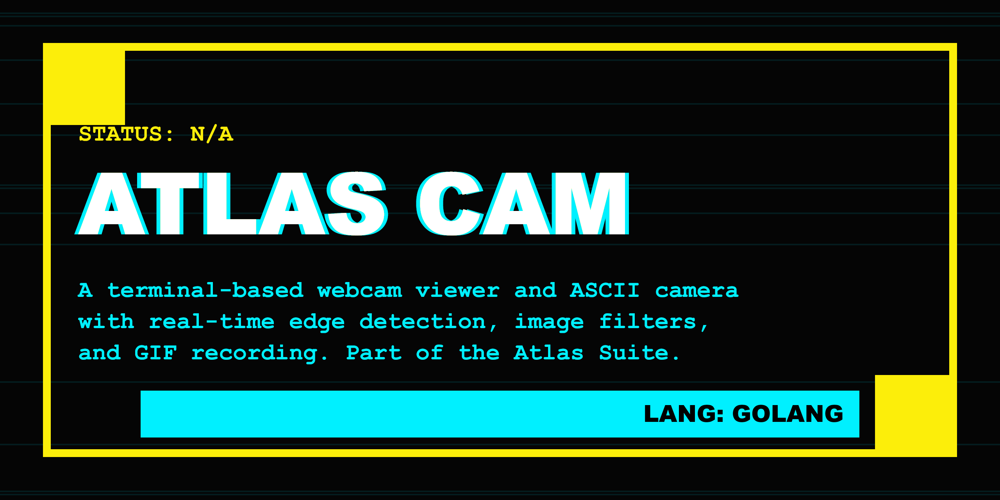

# Atlas Cam



**atlas.cam** is a terminal-based webcam viewer and ASCII camera. Part of the **Atlas Suite**, it brings the retro-futuristic vibe of ASCII art to your video feed with real-time edge detection and GIF recording capabilities.


## ✨ Features

- 📹 **Live ASCII Feed:** View your webcam feed directly in the terminal as ASCII art or ANSI blocks.
- 📸 **Snapshots:** Take photos that are saved as both high-res filtered JPEGs and corresponding ASCII text files.
- 🎥 **GIF Recording:** Record short video clips directly to animated GIFs in any mode.
- 🧠 **Structure Mode:** Real-time edge detection (Sobel operator) converts video into structure-aware ASCII art.
- 🎨 **Filters:** Apply real-time filters like Grayscale, Invert, Sepia, Red, Green, and Blue tints.
- 🌈 **Color Mode:** View the full-color feed using ANSI block characters (`█`).
- 🔄 **Multi-Camera Support:** Detect and switch between available video input devices.
- 📦 **Zero Dependencies:** Compiles to a single binary (Windows requires CGO for MediaFoundation).

## 🚀 Installation

### From Source
```bash
git clone https://github.com/fezcode/atlas.cam
cd atlas.cam
gobake build
```

## ⌨️ Usage

Simply run the binary:
```bash
./atlas.cam
```

## 🕹️ Controls

| Key | Action |
|-----|--------|
| `Space` | **Take Photo** (Saves to `~/Pictures/AtlasCam/`) |
| `r` | **Record GIF** (Press again to stop) |
| `m` | **Cycle Mode** (ASCII -> Detailed -> Color -> Structure) |
| `f` | **Cycle Filter** (None, Grayscale, Sepia, Red, Green, Blue) |
| `c` | **Switch Camera** (Cycle available inputs) |
| `?` | **Toggle Help** (Show/Hide key bindings) |
| `q` / `Esc` | **Quit** |

## 📂 Output

Photos and GIFs are saved in your user's Pictures folder:
- **Windows:** `%USERPROFILE%\Pictures\AtlasCam\`
- **Linux/macOS:** `~/Pictures/AtlasCam/`

## 🏗️ Building

This project uses **gobake** for orchestration.

```bash
# Build for current platform
gobake build
```

## 📄 License
MIT License - see [LICENSE](LICENSE) for details.
